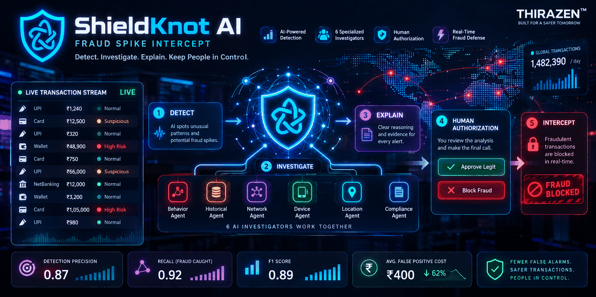

# 🛡️ ShieldKnot AI — Fraud Spike Intercept



<p align="center">
  <strong>Defense-only AI fraud risk operations prototype</strong><br>
  Detect spikes. Investigate evidence. Recommend defensively. Keep humans in control.
</p>

<p align="center">
  <a href="https://github.com/Ragul-ai-netron/sheildknot-ai-fraud-risk">📦 Repository</a>
  &nbsp;•&nbsp;
  <a href="#run-locally">💻 Run Locally</a>
  &nbsp;•&nbsp;
  <a href="#safety--authorization-design">🔐 Safety Design</a>
</p>

> **Razorpay Buildathon — Track 02: AI Risk Manager**

---

## 🎯 What Problem It Solves

Fraud teams can face sudden changes in fraud-risk density across channels, devices, geographies, customer tenure, transaction velocity, and transaction amounts.

**ShieldKnot AI** is a prototype for a defensive workflow that helps surface emerging risk spikes, investigate them from multiple perspectives, and produce evidence-backed recommendations while keeping final decisions behind deterministic safeguards and human authorization.

---

## ⚙️ How the System Works

```text
Transaction Data
       │
       ▼
┌──────────────────┐
│ Risk Scoring     │
└────────┬─────────┘
         ▼
┌──────────────────┐
│ Spike Detection  │
│ vs. Baseline     │
└────────┬─────────┘
         ▼
┌────────────────────────────────────┐
│ Specialized Investigation Agents   │
│                                    │
│ Channel • Device • Tenure          │
│ Geography • Velocity • Amount      │
└────────────────┬───────────────────┘
                 ▼
┌────────────────────────────────────┐
│ Evidence-backed Recommendations    │
└────────────────┬───────────────────┘
                 ▼
┌────────────────────────────────────┐
│ Deterministic Policy Safeguard     │
└────────────────┬───────────────────┘
                 ▼
┌────────────────────────────────────┐
│ Human Authorization                │
└────────────────┬───────────────────┘
                 ▼
┌────────────────────────────────────┐
│ Outcome + Verified Impact Record   │
└────────────────────────────────────┘
```

### 1. Ingest & Score
Transactions receive calibrated fraud-risk scores.

### 2. Detect Spikes
Rolling risk density is compared with a baseline. Abnormal density lift creates an incident for investigation.

### 3. Investigate
Six specialized investigators examine different dimensions:

- 📡 Channel
- 💻 Device
- 👤 Tenure
- 🌍 Geography
- ⚡ Velocity
- 💰 Amount

### 4. Recommend
The system generates defensive recommendations with evidence-linked provenance.

### 5. Safeguard
A deterministic policy layer gates recommendations before any operational action.

### 6. Record Outcomes
Human reviewers record the operational result and verified financial impact.

---

## 🤖 Specialized AI Investigation

The investigation workflow separates the problem into focused perspectives rather than relying on one undifferentiated analysis.

| Investigator | Focus |
|---|---|
| Channel | Risk changes across transaction channels |
| Device | Device-level anomaly patterns |
| Tenure | Customer/account age patterns |
| Geography | Geographic concentration and shifts |
| Velocity | Rapid transaction behavior |
| Amount | Transaction-value anomalies |

---

## 📊 Evaluation Metrics

**Project-reported held-out evaluation results:**

| Metric | Result |
|---|---:|
| Precision | **0.87** |
| Recall | **0.92** |
| F1 Score | **0.89** |
| Average false-positive cost | **₹400** |

These values describe the project's reported evaluation results and should not be interpreted as production-system guarantees.

---

## 🔐 Safety & Authorization Design

ShieldKnot is designed as a **defense-only prototype**.

- 🚫 Auto-block is disabled by default.
- 👤 Final actions require human authorization.
- 🧱 A deterministic policy layer acts as the final gate.
- 🔎 Recommendations are backed by investigation evidence.
- 🔑 The demo contains no production credentials or API keys.
- 🧪 The sign-in screen is a presentation/demo gate, not production authentication.

The design intentionally separates **AI-generated investigation/recommendation** from **authorized operational action**.

---

## 🖥️ Demo / Results

The current project is a browser-based frontend prototype demonstrating the ShieldKnot workflow.

### Demo flow

```text
Sign-in / Demo Gate
        ↓
Risk Overview
        ↓
Fraud Spike Detection
        ↓
Incident Investigation
        ↓
Evidence & Agent Findings
        ↓
Defensive Recommendation
        ↓
Policy Gate
        ↓
Human Authorization
        ↓
Outcome Recording
```

> The prototype demonstrates the workflow and interface. It is not presented as production fraud infrastructure.

---

## 💻 Run Locally

No build step is required for the current frontend prototype.

### Clone

```bash
git clone https://github.com/Ragul-ai-netron/sheildknot-ai-fraud-risk.git
cd sheildknot-ai-fraud-risk
```

### Start localhost

Recommended:

```bash
python3 -m http.server 8000
```

Then open:

**http://localhost:8000**

On Windows, if `python3` is not recognized:

```bash
python -m http.server 8000
```

Stop the server with:

```text
Ctrl + C
```

> The localhost server only serves the frontend prototype. It does not provide production authentication, a backend API, or real fraud-processing infrastructure.

---

## 🌐 GitHub Pages

To publish the frontend with GitHub Pages:

1. Open the repository's **Settings**.
2. Select **Pages**.
3. Under **Build and deployment**, choose **Deploy from a branch**.
4. Select the `main` branch.
5. Select `/ (root)`.
6. Click **Save**.
7. Open the generated Pages URL.

If your Pages site is already enabled, add its URL to the button at the top of this README.

---

## 📁 Project Structure

```text
sheildknot-ai-fraud-risk/
├── index.html
└── README.md
```

---

## 🧪 Project Scope

ShieldKnot is a **prototype for defensive fraud-risk intelligence**.

It demonstrates:

- Fraud-risk spike detection
- Multi-perspective investigation
- Specialized AI investigation roles
- Evidence-backed recommendations
- Deterministic safety controls
- Human-in-the-loop authorization
- Operational outcome recording
- Browser-based deployment

It is not presented as a production fraud-detection or payment-blocking system.

---

## 👨‍💻 Credits

**Ragul // AI Engineer**

Building intelligent systems. Turning ideas into products.

**THIRAZEN™**

---

## 📜 License

Add the project's preferred license here if/when one is selected.
